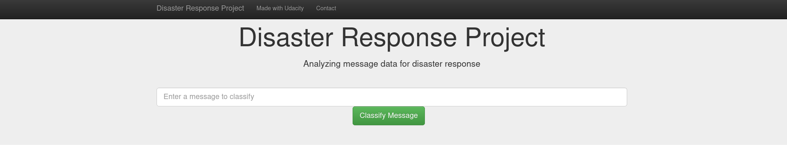

# Disaster Response Pipeline Project

## Classification of messages received into different categories

## Table of Content

1. Libraries
2. Motivation for the project
3. File descriptions
4. Instructions to Run the Code
5. Images/ Screenshots
6. Discussion 
7. Acknowledgement

## 1. Libraries

- python (>3.6)
- pandas
- skLearn
- pickle
- SQLalchemy
- Plotly
- flask

## 2. Motivation for the Project

One challenge to delivering the necessary aid to people affected by a natural any form of disaster is knowing what they might be in need of. Different people will have different needs. This project, which is part of the Udacity DataScience Nano Degree program aims at helping classify messages that are sent by people in need into different categories and help with planning on how to distribute the available resources and aid. 

## 3. File Description

├── app\
│   ├── run.py \
│   └── templates\
│       ├── go.html\
│       └── master.html\
├── data\
│   ├── disaster_categories.csv\
│   ├── disaster_messages.csv\
│   ├── DisasterResponse.db\
│   └── process_data.py >>> python script for loading, cleaning and saving data\
                           into sqlite  database (ETL pipeline)\
├── models\
│   ├── classifier.pkl\ the trained model\
│   └── train_classifier.py\ >>>ML pipeline. the script trains and tunes a model using\
                            GridSearchCV then saves the final model \
├── Notebooks\
│   ├── ETL Pipeline Preparation.ipynb\
│   └── ML Pipeline Preparation.ipynb\
└── README.md

## 4. Instructions to run the code:

1. Run the following commands in the project's root directory to set up your database and model.

    - To run ETL pipeline that cleans data and stores in database
        `python data/process_data.py data/disaster_messages.csv data/disaster_categories.csv data/DisasterResponse.db`
    - To run ML pipeline that trains classifier and saves
        `python models/train_classifier.py data/DisasterResponse.db models/classifier.pkl`

2. Run the following command in the app's directory to run your web app.
    `python run.py`

3. Go to http://0.0.0.0:3001/

## 5. Images / Screenshots

Home page 
Test 1 
Test 2 
Test 3 

## 6. Discussion

The performance of the model is greatly impacted by the imbalanced data. The Training time is also a major factor as the more parameters are added and tuned, the more time the project takes to train. 

## 7. Author & Acknowledgement 

Author: Eliud Nduati

Acknowledgement:
The Data is provided by 
[Figure Eight] (https://appen.com)

The project is part of the [Udacity Datascience Nano Degree Program]
